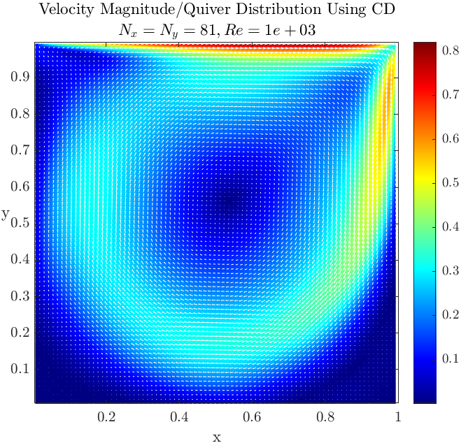
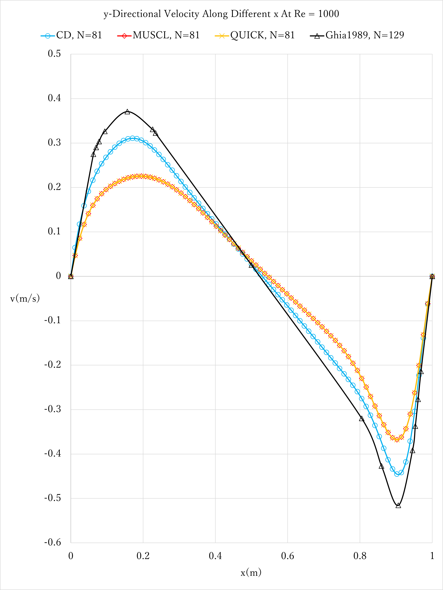
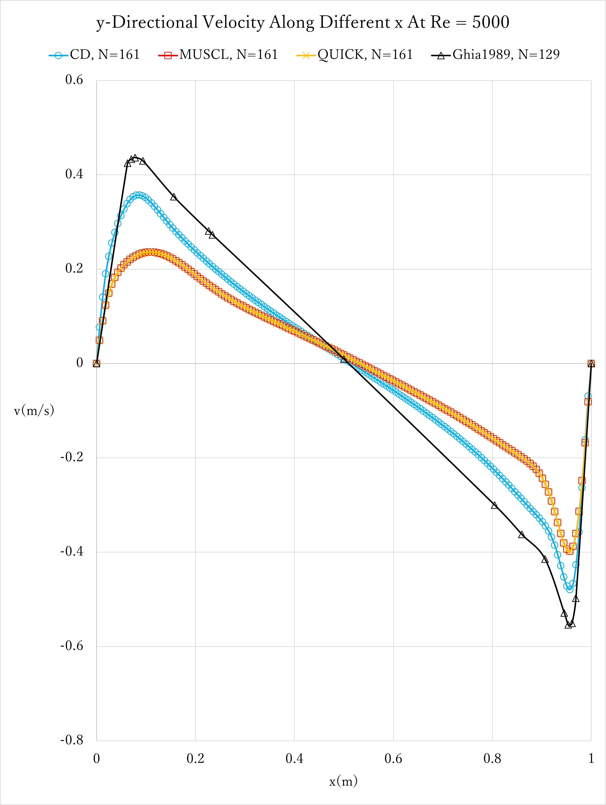

# Staggered-grid Lid Driven Cavity Problem Study

## I. Overview

This repo is my 3rd assignment submission of the course 11110PME511300 Computational Fluid Dynamics in 2022 Fall, lectured by [Prof. Chao-An Lin](https://scholar.google.com/citations?user=KHU451AAAAAJ&hl=en). I wrote the original report in LaTeX on 2023 Jan 11, and commited the files to GitHub on 2025 Aug 20.

## II. Program structure and key files

To run the program, just download the `CA3_2022.m` file and the `MAIN LIBRARY/` folder in the same directory, and you're good to go on MATLAB. **Do Not Change The Folder Name**, lest the path commands produce error warnings.

## III. Problem description

Consider the continuity equation in a 2D.

  

  <em>Figure 1. Domain.</em>

Consider the continuity equation in a 2D.

$$
\begin{align}
    % \label{eq:1}
    \frac{\partial \rho U}{\partial x} + \frac{\partial \rho V}{\partial y} = 0
\end{align}
$$

And the steady-state Navier-Stokes equation in 2D.

$$
\begin{align}
    % \label{eq:2}
    \frac{\partial \rho UU}{\partial x} + \frac{\partial \rho VU}{\partial y} = -\frac{\partial P}{\partial x} + \mu[\frac{\partial^{2} U}{\partial x^{2}} + \frac{\partial^{2} U}{\partial y^{2}}]
\end{align}
$$
$$
\begin{align}
    % \label{eq:3}
    \frac{\partial \rho UV}{\partial x} + \frac{\partial \rho VV}{\partial y} = -\frac{\partial P}{\partial y} + \mu[\frac{\partial^{2} V}{\partial x^{2}} + \frac{\partial^{2} V}{\partial y^{2}}]
\end{align}
$$

the Dirichlet boundary conditions are imposed strongly, $U_{\Gamma^1} = V_{\Gamma^1} = U_{\Gamma^2} = V_{\Gamma^2} = U_{\Gamma^3} = V_{\Gamma^3} = V_{\Gamma^4} = 0$ and $U_{\Gamma^4} = 1$. The Reynolds number is defined as $Re = \rho U_{\Gamma^4}L / \mu$, the lid velocity $U_{\Gamma^4} = 1 m/s$ and the cavity height $L = 1 m$.

1. Please compute the cavity flows with Reynolds numbers 100, 1000, and 5000.
2. Please use mesh sizes at least 81x81 and 161x161.
3. Please also compare your results with the benchmark solutions from Gihia et al. (1982) for u(y) at x=0.5 and v(x) at y=0.5.
4. Please compare the accuracy of the central difference, QUICK and MUSCL schemes.

## IV. Methodology

### 4.1 Convergence Criterion

Let the correction terms be the velocity at the current time step minus the one in the previous time step.

$$
\begin{align}
% \label{eq:5}
    \begin{split}
        &u_{corr} = u^{n} - u^{n-1}\\
        &v_{corr} = v^{n} - v^{n-1}\\
    \end{split}
\end{align}
$$
Define the maximum of infinity norms of two velocities, 
$$
\begin{align}
    % \label{eq:6}
    max(\{\lVert u_{corr}\rVert_{\infty}, \lVert v_{corr}\rVert_{\infty}\})
\end{align}
$$
which is also the largest row sum of A, $max(\sum{\lvert A^{T} \rvert})$, s.t. convergent iff.
$$
\begin{align}
    % \label{eq:7} -->
    max(\{\lVert u_{corr}\rVert_{\infty}, \lVert v_{corr}\rVert_{\infty}\}) < TOL_{abs} = 10^{-4}U_{\Gamma_{4}}
\end{align}
$$

### 4.2 Preliminary Finite Volume Derivation

  

  <em>Figure 2. Mass flow rates over a single mesh.</em>

Integrate Equation (2) over a single mesh,

$$
\begin{align}
    % \label{eq:8}
    \int_{s}^{n} \int_{w}^{e} [\frac{\rho \partial UU}{\partial x} + \frac{\rho \partial VU}{\partial y} = -\frac{\partial P}{\partial x} + \mu_{Re}(\frac{\partial^{2} U}{\partial x^{2}} + \frac{\partial^{2} U}{\partial y^{2}})] dxdy
\end{align}
$$

And then, we have the discretized momentum equation in the x-direction.

$$
\begin{align}
\begin{split}
    % \label{eq:9}
    &\dot{m_e}U_{e} - \dot{m_w}U_{w} + \dot{m_n}U_{n} - \dot{m_s}U_{s} = -(P_e - P_w) \delta y\\ + &D_e (U_E - U_P) - D_w (U_P - U_W) + D_n (U_N - U_P) - D_s (U_P - U_S)
\end{split}
\end{align}
$$

Then, integrate Equation (3) over a single mesh,

$$
\begin{align}
    % \label{eq:10}
    \int_{s}^{n} \int_{w}^{e} [\frac{\rho \partial UV}{\partial x} + \frac{\rho \partial VV}{\partial y} = -\frac{\partial P}{\partial y} + \mu_{Re}(\frac{\partial^{2} V}{\partial x^{2}} + \frac{\partial^{2} V}{\partial y^{2}})] dxdy
\end{align}
$$

And then, we have the discretized momentum equation in the y-direction.

$$
\begin{align}
\begin{split}
    % \label{eq:11}
    &\dot{m_e}V_{e} - \dot{m_w}V_{w} + \dot{m_n}V_{n} - \dot{m_s}V_{s} = -(P_n - P_s) \delta x\\ + &D_e (V_E - V_P) - D_w (V_P - V_W) + D_n (V_N - V_P) - D_s (V_P - V_S)
\end{split}
\end{align}
$$

Given the lid velocity $U_{\Gamma^4} = 1 m/s$, the cavity height $L = 1 m$ and the selection of Reynolds number, considering the incompressible flow $\rho = 1 kg/m^3$, the corresponding viscosity $\mu_{Re}$ is determined by Equation 4: $\mu_{100} = 1 \times 10^{-2}$, $\mu_{1000} = 1 \times 10^{-3}$, $\mu_{5000} = 2 \times 10^{-4}$. Although these equations are seemingly simplified, the coupling of velocity and pressure is yet unresolved. I adopted staggered mesh thusly to circumvent this issue.

Using the central differencing (CD) scheme to demonstrate the derivation of the SIMPLE algorithm. The mass flow rates for x-directional momentum conservation are

$$
\begin{align}
    % \label{eq:12}
    \begin{split}
        &\dot{m_e} = \frac{U_{E} + U_{P}}{2} \delta y = \frac{U_{i+1, j} + U_{i,j}}{2} \delta y\\
        &\dot{m_w} = \frac{U_{P} + U_{W}}{2} \delta y = \frac{U_{i, j} + U_{i-1,j}}{2} \delta y\\
        &\dot{m_n} = \frac{V_{N} + V_{WN}}{2} \delta x = \frac{V_{i, j+1} + V_{i-1,j+1}}{2} \delta x\\
        &\dot{m_s} = \frac{V_{P} + V_{W}}{2} \delta x = \frac{V_{i, j} + V_{i-1,j}}{2} \delta x\\
    \end{split}
\end{align}
$$

And those in y-directional momentum conservation are

$$
\begin{align}
    % \label{eq:13}
    \begin{split}
        &\dot{m_e} = \frac{U_{E} + U_{ES}}{2} \delta y = \frac{U_{i+1, j} + U_{i+1,j-1}}{2} \delta y\\
        &\dot{m_w} = \frac{U_{P} + U_{S}}{2} \delta y = \frac{U_{i, j} + U_{i,j-1}}{2} \delta y\\
        &\dot{m_n} = \frac{V_{N} + V_{P}}{2} \delta x = \frac{V_{i, j+1} + V_{i,j}}{2} \delta x\\
        &\dot{m_s} = \frac{V_{P} + V_{S}}{2} \delta x = \frac{V_{i, j} + V_{i,j-1}}{2} \delta x\\
    \end{split}
\end{align}
$$

The diffusive coefficients are all the same regardless of directions, $D_i = \frac{\mu \delta y_{i}}{\delta x_{i}}$, $i = e,w,n,s$. For homogeneous mesh, $\delta y_{i} = \delta x_{i}$, $i = e,w,n,s$,

$$
\begin{align}
    % \label{eq:14}
    D_e = D_w = D_n = D_s = \mu
\end{align}
$$

The CD suggests that the pointal value $U_{i}$, $i = e,w,n,s$, is in the form of

$$
\begin{align}
    % \label{eq:15}
    \begin{split}
        &U_e = \frac{U_{P} + U_{E}}{2}\\
        &U_w = \frac{U_{W} + U_{P}}{2}\\
        &U_n = \frac{U_{N} + U_{P}}{2}\\
        &U_s = \frac{U_{P} + U_{S}}{2}\\
    \end{split}
\end{align}
$$

And the point value $V_{i}$, $i = e,w,n,s$ is in the form of

$$
\begin{align}
    % \label{eq:16}
    \begin{split}
        &V_e = \frac{V_{P} + V_{E}}{2}\\
        &V_w = \frac{V_{W} + V_{P}}{2}\\
        &V_n = \frac{V_{N} + V_{P}}{2}\\
        &V_s = \frac{V_{P} + V_{S}}{2}\\
    \end{split}
\end{align}
$$

Substitute Equation (15) in Equation (9), the x-directional momentum conservation is rewritten as

$$
\begin{align}
\begin{split}
    % \label{eq:17}
    &(D_{e} + D_{w} + D_{n} + D_{s} + \frac{\dot{m_e}}{2} - \frac{\dot{m_w}}{2} + \frac{\dot{m_n}}{2} - \frac{\dot{m_s}}{2})U_{P}\\
    = -(&P_{e} - P_{w}) \delta y + (D_{e} - \frac{\dot{m_e}}{2})U_{E} + (D_{w} + \frac{\dot{m_w}}{2})U_{W} + (D_{n} - \frac{\dot{m_n}}{2})U_{N} + (D_{s} + \frac{\dot{m_s}}{2})U_{S}\\
\end{split}
\end{align}
$$

In the same way, substitute Equation (16) in Equation (11), the y-directional momentum conservation is rewritten as

$$
\begin{align}
\begin{split}
    % \label{eq:18}
    &(D_{e} + D_{w} + D_{n} + D_{s} + \frac{\dot{m_e}}{2} - \frac{\dot{m_w}}{2} + \frac{\dot{m_n}}{2} - \frac{\dot{m_s}}{2})V_{P}\\
    = -(&P_{n} - P_{s}) \delta y + (D_{e} - \frac{\dot{m_e}}{2})V_{E} + (D_{w} + \frac{\dot{m_w}}{2})V_{W} + (D_{n} - \frac{\dot{m_n}}{2})V_{N} + (D_{s} + \frac{\dot{m_s}}{2})V_{S}\\
\end{split}
\end{align}
$$

Add the flux limiter to Equations (17) and (18),

$$
\begin{align}
\begin{split}
    % \label{eq:19}
    &(D_{e} + D_{w} + D_{n} + D_{s} + \frac{\dot{m_e}}{2} - \frac{\dot{m_w}}{2} + \frac{\dot{m_n}}{2} - \frac{\dot{m_s}}{2})U_{P}\\
    = -(&P_{e} - P_{w}) \delta y + (D_{e} - \frac{\dot{m_e}}{2})U_{E} + (D_{w} + \frac{\dot{m_w}}{2})U_{W} + (D_{n} - \frac{\dot{m_n}}{2})U_{N} + (D_{s} + \frac{\dot{m_s}}{2})U_{S}\\
        \textcolor{red}{-(}&\textcolor{red}{\dot{m_{e}}[\frac{\psi(r_{e})}{2}(U_{E} - U_{P})] - \dot{m_{w}}[\frac{\psi(r_{w})}{2}(U_{P} - U_{W})] + \dot{m_{n}}[\frac{\psi(r_{n})}{2}(U_{N} - U_{P})] -\dot{m_{s}}[\frac{\psi(r_{s})}{2}(U_{P} - U_{S})])}
\end{split}
\end{align}
$$

$$
\begin{align}
\begin{split}
    % \label{eq:20}
    &(D_{e} + D_{w} + D_{n} + D_{s} + \frac{\dot{m_e}}{2} - \frac{\dot{m_w}}{2} + \frac{\dot{m_n}}{2} - \frac{\dot{m_s}}{2})V_{P}\\
    = -(&P_{n} - P_{s}) \delta y + (D_{e} - \frac{\dot{m_e}}{2})V_{E} + (D_{w} + \frac{\dot{m_w}}{2})V_{W} + (D_{n} - \frac{\dot{m_n}}{2})V_{N} + (D_{s} + \frac{\dot{m_s}}{2})V_{S}\\
    \textcolor{red}{-(}&\textcolor{red}{\dot{m_{e}}[\frac{\psi(r_{e})}{2}(V_{E} - V_{P})] - \dot{m_{w}}[\frac{\psi(r_{w})}{2}(V_{P} - V_{W})] + \dot{m_{n}}[\frac{\psi(r_{n})}{2}(V_{N} - V_{P})] -\dot{m_{s}}[\frac{\psi(r_{s})}{2}(V_{P} - V_{S})])}
\end{split}
\end{align}
$$

Thus, the solutions

$$
\begin{align}
\begin{split}
    % \label{eq:21}
    U_{P} = [-(&P_{e} - P_{w}) \delta y + (D_{e} - \frac{\dot{m_e}}{2})U_{E} + (D_{w} + \frac{\dot{m_w}}{2})U_{W} + (D_{n} - \frac{\dot{m_n}}{2})U_{N} + (D_{s} + \frac{\dot{m_s}}{2})U_{S}\\
    - [&\dot{m_{e}}[\frac{\psi(r_{e})}{2}(U_{E} - U_{P})] - \dot{m_{w}}[\frac{\psi(r_{w})}{2}(U_{P} - U_{W})]\\
    + &\dot{m_{n}}[\frac{\psi(r_{n})}{2}(U_{N} - U_{P})] -\dot{m_{s}}[\frac{\psi(r_{s})}{2}(U_{P} - U_{S})]]]\\
    \div (&D_{e} + D_{w} + D_{n} + D_{s} + \frac{\dot{m_e}}{2} - \frac{\dot{m_w}}{2} + \frac{\dot{m_n}}{2} - \frac{\dot{m_s}}{2})
\end{split}
\end{align}
$$

$$
\begin{align}
\begin{split}
    % \label{eq:22}
    \Rightarrow U_{P} = (-(&P_{i,j} - P_{i-1,j}) \delta y\\
    + (&D_{e} - \frac{\dot{m_e}}{2})U_{i+1,j} + (D_{w} + \frac{\dot{m_w}}{2})U_{i-1,j} + (D_{n} - \frac{\dot{m_n}}{2})U_{i,j+1} + (D_{s} + \frac{\dot{m_s}}{2})U_{i,j-1}\\
    -(&\dot{m_{e}}[\frac{\psi(r_{e})}{2}(U_{i+1,j} - U_{i,j})] - \dot{m_{w}}[\frac{\psi(r_{w})}{2}(U_{i,j} - U_{i-1,j})]\\
    + &\dot{m_{n}}[\frac{\psi(r_{n})}{2}(U_{i,j+1} - U_{i,j})] -\dot{m_{s}}[\frac{\psi(r_{s})}{2}(U_{i,j} - U_{i,j-1})]))\\
    \div (&D_{e} + D_{w} + D_{n} + D_{s} + \frac{\dot{m_e}}{2} - \frac{\dot{m_w}}{2} + \frac{\dot{m_n}}{2} - \frac{\dot{m_s}}{2})
\end{split}
\end{align}
$$

$$
\begin{align}
\begin{split}
    % \label{eq:23}
    V_{P} = [-(&P_{n} - P_{s}) \delta y + (D_{e} - \frac{\dot{m_e}}{2})V_{E} + (D_{w} + \frac{\dot{m_w}}{2})V_{W} + (D_{n} - \frac{\dot{m_n}}{2})V_{N} + (D_{s} + \frac{\dot{m_s}}{2})V_{S}\\
    -[&\dot{m_{e}}[\frac{\psi(r_{e})}{2}(V_{E} - V_{P})] - \dot{m_{w}}[\frac{\psi(r_{w})}{2}(V_{P} - V_{W})]\\
    + &\dot{m_{n}}[\frac{\psi(r_{n})}{2}(V_{N} - V_{P})] -\dot{m_{s}}[\frac{\psi(r_{s})}{2}(V_{P} - V_{S})]]]\\
    \div (&D_{e} + D_{w} + D_{n} + D_{s} + \frac{\dot{m_e}}{2} - \frac{\dot{m_w}}{2} + \frac{\dot{m_n}}{2} - \frac{\dot{m_s}}{2})
\end{split}
\end{align}
$$

$$
\begin{align}
\begin{split}
    % \label{eq:24}
    \Rightarrow V_{P} = [-(&P_{i,j} - P_{i,j-1}) \delta y\\
    + (&D_{e} - \frac{\dot{m_e}}{2})V_{i+1,j} + (D_{w} + \frac{\dot{m_w}}{2})V_{i-1,j} + (D_{n} - \frac{\dot{m_n}}{2})V_{i,j+1} + (D_{s} + \frac{\dot{m_s}}{2})V_{i,j-1}\\
    -[&\dot{m_{e}}[\frac{\psi(r_{e})}{2}(V_{i+1,j} - V_{i,j})] - \dot{m_{w}}[\frac{\psi(r_{w})}{2}(V_{i,j} - V_{i-1,j})]\\
    + &\dot{m_{n}}[\frac{\psi(r_{n})}{2}(V_{i,j+1} - V_{i,j})] -\dot{m_{s}}[\frac{\psi(r_{s})}{2}(V_{i,j} - V_{i,j-1})]]]\\
    \div (&D_{e} + D_{w} + D_{n} + D_{s} + \frac{\dot{m_e}}{2} - \frac{\dot{m_w}}{2} + \frac{\dot{m_n}}{2} - \frac{\dot{m_s}}{2})
\end{split}
\end{align}
$$

where $\psi(r_{i}) = r_{i}$, $i=e,w,n,s$, for CD, and $r_{i} =(\phi_{D} - \phi_{C})/(\phi_{C} - \phi_{U} + \epsilon)$, in which $D$, $C$, $U$ signifies downwind, central, upwind point respectively. $\phi$ is the variable TBD, which is $U$ in x-directional momentum conservation, and $V$ in y-directional momentum conservation.

Notice that the term, $\dot{m_{e}} - \dot{m_{w}} + \dot{m_{n}} - \dot{m_{s}}$, does not satisfy Equation (1), the continuity equation. Therefore, I introduced the SIMPLE method to couple the pressure and velocities.

### 4.3 Introduction of The SIMPLE (Semi-Implicit Method for Pressure Linked Equations) Algorithm

Add the correction terms to Equations (23) and (24) to satisfy Equation (1). By the SIMPLE algorithm, the correction terms are reduced to the corrected pressure term.

$$
\begin{align}
\begin{split}
    % \label{eq:25}
    U_{P} = [-(&P_{i,j} - P_{i-1,j}) \delta y - \textcolor{red}{(P'_{i,j} - P'_{i-1,j})\delta y}\\
\end{split}
\end{align}
$$

$$
% + (&D_{e} - \frac{\dot{m_e}}{2})U_{i+1,j} + (D_{w} + \frac{\dot{m_w}}{2})U_{i-1,j} + (D_{n} - \frac{\dot{m_n}}{2})U_{i,j+1} + (D_{s} + \frac{\dot{m_s}}{2})U_{i,j-1}\\
%     -[&\dot{m_{e}}[\frac{\psi(r_{e})}{2}(U_{i+1,j} - U_{i,j})] - \dot{m_{w}}[\frac{\psi(r_{w})}{2}(U_{i,j} - U_{i-1,j})]\\
%     + &\dot{m_{n}}[\frac{\psi(r_{n})}{2}(U_{i,j+1} - U_{i,j})] -\dot{m_{s}}[\frac{\psi(r_{s})}{2}(U_{i,j} - U_{i,j-1})]]]\\
%     \div (&D_{e} + D_{w} + D_{n} + D_{s} + \frac{\dot{m_e}}{2} - \frac{\dot{m_w}}{2} + \frac{\dot{m_n}}{2} - \frac{\dot{m_s}}{2})
$$

$$
\begin{align}
\begin{split}
    % \label{eq:26}
    V_{P} = [-(&P_{i,j} - P_{i,j-1}) \delta y \textcolor{red}{ - (P'_{i,j} - P'_{i,j-1})\delta y}\\
    + (&D_{e} - \frac{\dot{m_e}}{2})V_{i+1,j} + (D_{w} + \frac{\dot{m_w}}{2})V_{i-1,j} + (D_{n} - \frac{\dot{m_n}}{2})V_{i,j+1} + (D_{s} + \frac{\dot{m_s}}{2})V_{i,j-1}\\
    -[&\dot{m_{e}}[\frac{\psi(r_{e})}{2}(V_{i+1,j} - V_{i,j})] - \dot{m_{w}}[\frac{\psi(r_{w})}{2}(V_{i,j} - V_{i-1,j})]\\
    + &\dot{m_{n}}[\frac{\psi(r_{n})}{2}(V_{i,j+1} - V_{i,j})] -\dot{m_{s}}[\frac{\psi(r_{s})}{2}(V_{i,j} - V_{i,j-1})]]]\\
    \div (&D_{e} + D_{w} + D_{n} + D_{s} + \frac{\dot{m_e}}{2} - \frac{\dot{m_w}}{2} + \frac{\dot{m_n}}{2} - \frac{\dot{m_s}}{2})
\end{split}
\end{align}
$$

where the corrected pressure term for the x-directional momentum equation is

$$
\begin{align}
\begin{split}
    % \label{eq:27}
    &P'_{i,j} = \frac{\sum A_{C}P_{C} - \Delta \dot{m}^{*}}{A_{P}^{U}} = \frac{\sum A_{C}P_{C} - (\dot{m_{e}} - \dot{m_{w}} + \dot{m_{n}} - \dot{m_{s}})}{A_{P}^{U}}\\
    &P'_{i-1,j} = \frac{\sum A_{W}P_{W} - \Delta \dot{m}^{*}}{A_{P}^{U}} = \frac{\sum A_{C}P_{C} - (\dot{m_{e}} - \dot{m_{w}} + \dot{m_{n}} - \dot{m_{s}})}{A_{P}^{U}}\\
    &P'_{i,j-1} = \frac{\sum A_{S}P_{S} - \Delta \dot{m}^{*}}{A_{P}^{U}} = \frac{\sum A_{C}P_{C} - (\dot{m_{e}} - \dot{m_{w}} + \dot{m_{n}} - \dot{m_{s}})}{A_{P}^{U}}
\end{split}
\end{align}
$$

and the corrected pressure term for the y-directional momentum equation is

$$
\begin{align}
\begin{split}
    % \label{eq:28}
    &P'_{i,j} = \frac{\sum A_{C}P_{C} - \Delta \dot{m}^{*}}{A_{P}^{V}}\\
    &P'_{i-1,j} = \frac{\sum A_{W}P_{W} - \Delta \dot{m}^{*}}{A_{P}^{V}}\\
    &P'_{i,j-1} = \frac{\sum A_{S}P_{S} - \Delta \dot{m}^{*}}{A_{P}^{V}}
\end{split}
\end{align}
$$

And this is the SIMPLE implementation using central differencing scheme. For other schemes: LUD (Linear Upwind Differencing), QUICK (Quadratic Upstream Interpolation for Convective Kinematics), TVD (Total Variation Diminishing), TVD QUICK, MUSCL (Monotonic Upstream-centered Scheme for Conservation Laws), etc., a slight modification of the $U_i (i=e,w,n,s)$ and $V_i (i=e,w,n,s)$ to their corresponding representation is required. The details can be found in chapter 5 of [CFD lecture note by Prof. Chao-An Lin, 2021)](https://www.dropbox.com/sh/9pf315uw8oqsf82/AAAtYTy2L2sqPbYyu2l6mPoSa?dl=0).

## V. Result and discussion

### 5.1 Result

<table align="center">
  <tr>
    <td align="center">
       
      (a)
    </td>
    <td align="center">
       
      (b)
    </td>
    <td align="center">
       
      (c)
    </td>
  </tr>
  <tr>
    <td align="center">
       
      (d)
    </td>
    <td align="center">
       
      (e)
    </td>
    <td align="center">
       
      (f)
    </td>
  </tr>
</table>

    <em>Figure 3. Results of central differencing scheme: (a) Reynolds number of 100 under grid size of 81, (b) Reynolds number of 1000 under grid size of 81 (c) Reynolds number of 5000 under grid size of 81 (d) Reynolds number of 100 under grid size of 161 (e) Reynolds number of 1000 under grid size of 161 (f) Reynolds number of 5000 under grid size of 161.</em>

<table align="center">
  <tr>
    <td align="center">
       
      (a)
    </td>
    <td align="center">
       
      (b)
    </td>
    <td align="center">
       
      (c)
    </td>
  </tr>
  <tr>
    <td align="center">
       
      (d)
    </td>
    <td align="center">
       
      (e)
    </td>
    <td align="center">
       
      (f)
    </td>
  </tr>
</table>

    <em>Figure 4. Results of Quadratic Upstream Interpolation for Convective Kinematics (QUICK) scheme: (a) Reynolds number of 100 under grid size of 81, (b) Reynolds number of 1000 under grid size of 81 (c) Reynolds number of 5000 under grid size of 81 (d) Reynolds number of 100 under grid size of 161 (e) Reynolds number of 1000 under grid size of 161 (f) Reynolds number of 5000 under grid size of 161.</em>

<table align="center">
  <tr>
    <td align="center">
       
      (a)
    </td>
    <td align="center">
       
      (b)
    </td>
    <td align="center">
       
      (c)
    </td>
  </tr>
  <tr>
    <td align="center">
       
      (d)
    </td>
    <td align="center">
       
      (e)
    </td>
    <td align="center">
       
      (f)
    </td>
  </tr>
</table>

    <em>Figure 5. Results of Monotonic Upstream-centered Scheme for Conservation Laws (MUSCL) scheme: (a) Reynolds number of 100 under grid size of 81, (b) Reynolds number of 1000 under grid size of 81 (c) Reynolds number of 5000 under grid size of 81 (d) Reynolds number of 100 under grid size of 161 (e) Reynolds number of 1000 under grid size of 161 (f) Reynolds number of 5000 under grid size of 161.</em>

### 5.2 Discussion

From Figures (3), (4), and (5), I drew the centered lines at $x=0.5$ for the x-directional velocity $u(y)$, and at $y=0.5$ for the y-directional velocity $v(x)$ using Microsoft Office Excel. The Ghia1989, $N = 129$ curves are fitted from the sample points.

Notice that the schemes produce similar characteristics at low Reynolds numbers in Fig (6) and (9), but variate at high Reynolds numbers in Fig (8) and (11). The MUSCL and QUICK schemes resemble because of the same ground rock on which they are built, the upwind differencing scheme. While they look similar, the values are slightly different. Choosing the Reynolds number of $5000$ (largest Reynolds number) and grid size of $161$ (finest spatial resolution), the difference in x-directional velocity is seen in the point values of Figure (8)(a) in Table (2); that in y-directional velocity is seen in the point values of Figure (8)(b) in Table (3).

**Table 2. First ten values of $u(y)$**

| y (m)       | $u(y)_{CD}$ (m/s) | $u(y)_{MUSCL}$ (m/s) | $u(y)_{QUICK}$ (m/s) |
|-------------|-------------------|-----------------------|-----------------------|
| 0           | 0                 | 0                     | 0                     |
| 0.006172840 | 0.076742197       | 0.049134526           | 0.049183673           |
| 0.012345679 | 0.14049004        | 0.090517207           | 0.090604849           |
| 0.018518519 | 0.190035281       | 0.123695103           | 0.123809749           |
| 0.024691358 | 0.227110941       | 0.149204069           | 0.149335855           |
| 0.030864198 | 0.255237398       | 0.168315656           | 0.16845755            |
| 0.037037037 | 0.277773476       | 0.182590392           | 0.182738206           |
| 0.043209877 | 0.296858955       | 0.193486394           | 0.193638087           |
| 0.049382716 | 0.31339041        | 0.202128973           | 0.202283633           |
| 0.055555556 | 0.32749287        | 0.209261662           | 0.209418771           |

**Table 3. First ten values of $v(x)$**

| x (m)       | $v(x)_{CD}$ (m/s) | $v(x)_{MUSCL}$ (m/s) | $v(x)_{QUICK}$ (m/s) |
|-------------|-------------------|----------------------|----------------------|
| 0           | 0                 | 0                    | 0                    |
| 0.006172840 | -0.136405976      | -0.094255483         | -0.094363291         |
| 0.012345679 | -0.187299161      | -0.135710999         | -0.135861958         |
| 0.018518519 | -0.227580313      | -0.169952973         | -0.170136119         |
| 0.024691358 | -0.260391073      | -0.196824535         | -0.197029379         |
| 0.030864198 | -0.288312577      | -0.217209931         | -0.21742801          |
| 0.037037037 | -0.31248656       | -0.232395834         | -0.23262089          |
| 0.043209877 | -0.3329256        | -0.243638087         | -0.243865661         |
| 0.049382716 | -0.349175307      | -0.25194424          | -0.252171117         |
| 0.055555556 | -0.360808374      | -0.258018899         | -0.258242631         |

Overall, despite the deviation in values, the trend displays consistency. To better compare the results, the following figures are drawn.

<table align="center">
  <tr>
    <td align="center">
       
      (a)
    </td>
    <td align="center">
       
      (b)
    </td>
  </tr>
  <tr>
    <td align="center">
       
      (c)
    </td>
    <td align="center">
       
      (d)
    </td>
  </tr>
  <tr>
    <td align="center">
       
      (e)
    </td>
    <td align="center">
       
      (f)
    </td>
  </tr>
</table>

    <em>Figure 6. Results of grid size of 81, compared with benchmark solution in (a) u(y) at x = 0.5 and  Re = 100, (b) v(x) at y = 0.5 and  Re = 100, (c) u(y) at x = 0.5 and  Re = 1000, (d) v(x) at y = 0.5 and  Re = 1000, (e) u(y) at x = 0.5 and  Re = 5000, (f) v(x) at y = 0.5 and  Re = 5000.</em>

<table align="center">
  <tr>
    <td align="center">
       
      (a)
    </td>
    <td align="center">
       
      (b)
    </td>
  </tr>
  <tr>
    <td align="center">
       
      (c)
    </td>
    <td align="center">
       
      (d)
    </td>
  </tr>
  <tr>
    <td align="center">
       
      (e)
    </td>
    <td align="center">
       
      (f)
    </td>
  </tr>
</table>

    <em>Figure 7. Results of grid size of 161, compared with benchmark solution in (a) u(y) at x = 0.5 and  Re = 100, (b) v(x) at y = 0.5 and  Re = 100, (c) u(y) at x = 0.5 and  Re = 1000, (d) v(x) at y = 0.5 and  Re = 1000, (e) u(y) at x = 0.5 and  Re = 5000, (f) v(x) at y = 0.5 and  Re = 5000.</em>

## VII. Summary

In this study, the Lid-driven cavity is explored using finite volume analysis. Different schemes (CD, QUICK, and MUSCL) are employed in the SIMPLE algorithm with the benchmark solution [(Ghia et al)](https://www.sciencedirect.com/science/article/abs/pii/0021999182900584). The four results are similar at low Reynolds numbers, but not at high Reynolds numbers. Despite the deviated values, the trends are consistent regardless of the magnitude of the Reynolds number. And QUICK and MUSCL schemes bear a resemblance in accuracy.

## VIII. References

- [Ghia et al., High-Re solutions for incompressible flow using the Navier-Stokes equations and a multigrid method, Journal of Computational Physics, 1982.](https://www.sciencedirect.com/science/article/abs/pii/0021999182900584)
- [White, Viscous Fluid Flow, McGraw-Hill Education, 2006.](https://www.mheducation.com/highered/product/Viscous-Fluid-Flow-White.html)
